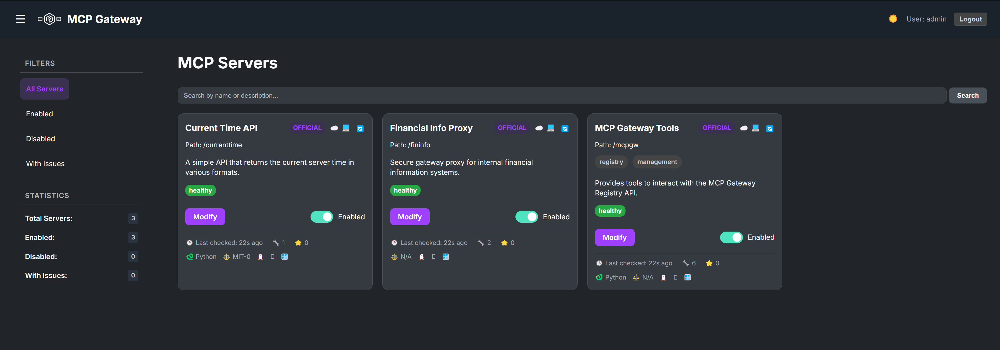
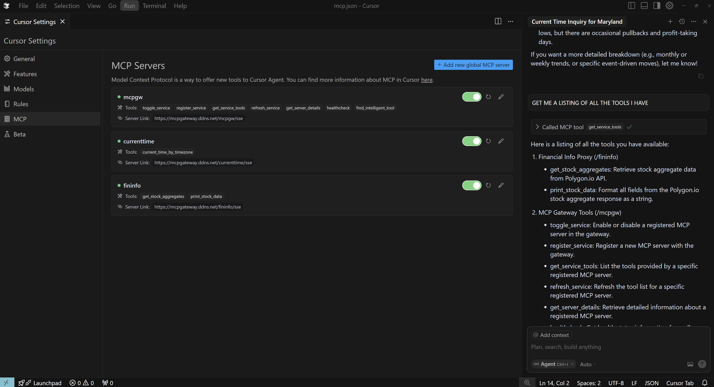

# ⚠️ ACTIVE DEVELOPMENT - WORK IN PROGRESS ⚠️

> **WARNING**: This repository is under active development. Expect frequent updates and breaking changes as we improve functionality and refine APIs. We recommend pinning to specific versions for production use. Star the repository to track our progress!


# MCP Gateway & Registry

[Model Context Protocol (MCP)](https://modelcontextprotocol.io/introduction) is an open standard protocol that allows AI Models to connect with external systems, tools, and data sources. A common problem that enterprises face while using MCP servers is that there is a need for a central point of access to a curated list of MCP servers and a catalog of such servers. This is the precise problem that this application provides a solution for by implementing an **MCP Gateway & Registry**. 

**<u>Demo Video</u>**: [https://www.youtube.com/watch?v=o_Wich7AChk](https://www.youtube.com/watch?v=o_Wich7AChk)

## Architecture

The Gateway works by using an [Nginx server](https://docs.nginx.com/nginx/admin-guide/web-server/reverse-proxy/) as a reverse proxy, where each MCP server is handled as a different _path_ and the Nginx reverse proxy sitting between the MCP clients (contained in AI Agents for example) and backend server forwards client requests to appropriate backend servers and returns the responses back to clients. The requested resources are then returned to the client.

The MCP Gateway provides a single endpoint to access multiple MCP servers and the Registry provides discoverability and management functionality for the MCP servers that an enterprise wants to use. An AI Agent written in any framework can connect to multiple MCP servers via this gateway, for example to access two MCP servers one called `weather`,  and another one called `currenttime` and agent would create an MCP client pointing `https://my-mcp-gateway.enterprise.net/weather/` and another one pointing to `https://my-mcp-gateway.enterprise.net/currenttime/`.  **This technique is able to support both SSE and Streamable HTTP transports**. 

```mermaid
flowchart TB
    subgraph AI_Agents["AI Agents"]
        Agent1["AI Agent 1"]
        Agent2["AI Agent 2"]
        Agent3["AI Agent 3"]
        AgentN["AI Agent N"]
    end

    subgraph EC2_Gateway["<b>MCP Gateway & Registry</b> (Amazon EC2 Instance)"]
        subgraph NGINX["NGINX Reverse Proxy"]
            RP["Reverse Proxy Router"]
        end
        
        subgraph LocalMCPServers["Local MCP Servers"]
            MCP_Local1["MCP Server 1"]
            MCP_Local2["MCP Server 2"]
        end
    end
    
    subgraph EKS_Cluster["Amazon EKS/EC2 Cluster"]
        MCP_EKS1["MCP Server 3"]
        MCP_EKS2["MCP Server 4"]
    end
    
    subgraph APIGW_Lambda["Amazon API Gateway + AWS Lambda"]
        API_GW["Amazon API Gateway"]
        Lambda1["AWS Lambda Function 1"]
        Lambda2["AWS Lambda Function 2"]
    end
    
    subgraph External_Systems["External Data Sources & APIs"]
        DB1[(Database 1)]
        DB2[(Database 2)]
        API1["External API 1"]
        API2["External API 2"]
        API3["External API 3"]
    end
    
    %% Connections from Agents to Gateway
    Agent1 -->|MCP Protocol<br>SSE| RP
    Agent2 -->|MCP Protocol<br>SSE| RP
    Agent3 -->|MCP Protocol<br>Streamable HTTP| RP
    AgentN -->|MCP Protocol<br>Streamable HTTP| RP
    
    %% Connections from Gateway to MCP Servers
    RP -->|SSE| MCP_Local1
    RP -->|SSE| MCP_Local2
    RP -->|SSE| MCP_EKS1
    RP -->|SSE| MCP_EKS2
    RP -->|Streamable HTTP| API_GW
    
    %% Connections within API GW + Lambda
    API_GW --> Lambda1
    API_GW --> Lambda2
    
    %% Connections to External Systems
    MCP_Local1 -->|Tool Connection| DB1
    MCP_Local2 -->|Tool Connection| DB2
    MCP_EKS1 -->|Tool Connection| API1
    MCP_EKS2 -->|Tool Connection| API2
    Lambda1 -->|Tool Connection| API3

    %% Style definitions
    classDef agent fill:#e1f5fe,stroke:#29b6f6,stroke-width:2px
    classDef gateway fill:#e8f5e9,stroke:#66bb6a,stroke-width:2px
    classDef nginx fill:#f3e5f5,stroke:#ab47bc,stroke-width:2px
    classDef mcpServer fill:#fff3e0,stroke:#ffa726,stroke-width:2px
    classDef eks fill:#ede7f6,stroke:#7e57c2,stroke-width:2px
    classDef apiGw fill:#fce4ec,stroke:#ec407a,stroke-width:2px
    classDef lambda fill:#ffebee,stroke:#ef5350,stroke-width:2px
    classDef dataSource fill:#e3f2fd,stroke:#2196f3,stroke-width:2px
    
    %% Apply styles
    class Agent1,Agent2,Agent3,AgentN agent
    class EC2_Gateway,NGINX gateway
    class RP nginx
    class MCP_Local1,MCP_Local2 mcpServer
    class EKS_Cluster,MCP_EKS1,MCP_EKS2 eks
    class API_GW apiGw
    class Lambda1,Lambda2 lambda
    class DB1,DB2,API1,API2,API3 dataSource
```

## Features

*   **Service Registration:** Register MCP services via JSON files or the web UI/API.
*   **Web UI:** Manage services, view status, and monitor health through a web interface.
*   **Authentication:** Secure login system for the web UI and API access.
*   **Health Checks:**
    *   Periodic background checks for enabled services (checks `/sse` endpoint).
    *   Manual refresh trigger via UI button or API endpoint.
*   **Real-time UI Updates:** Uses WebSockets to push health status, tool counts, and last-checked times to all connected clients.
*   **Dynamic Nginx Configuration:** Generates an Nginx reverse proxy configuration file (`registry/nginx_mcp_revproxy.conf`) based on registered services and their enabled/disabled state.
*   **MCP Tool Discovery:** Automatically fetches and displays the list of tools (name, description, schema) for healthy services using the MCP client library.
*   **Service Management:**
    *   Enable/Disable services directly from the UI.
    *   Edit service details (name, description, URL, tags, etc.).
*   **Filtering & Statistics:** Filter the service list in the UI (All, Enabled, Disabled, Issues) and view basic statistics.
*   **UI Customization:**
    *   Dark/Light theme toggle (persisted in local storage).
    *   Collapsible sidebar (state persisted in local storage).
*   **State Persistence:** Enabled/Disabled state is saved to `registry/server_state.json` (and ignored by Git).

## Prerequisites

*   An Amazon EC2 machine with a standard Ubuntu AMI for running this solution.
*   An SSL cert for securing the communication to the Gateway. _This Gateway uses a self-signed cert by default and is also available over HTTP_. 
*   One of the example MCP servers packaged in this repo uses the [`Polygon`](https://polygon.io/stocks) API for stock ticker data. Get an API key from [here](https://polygon.io/dashboard/signup?redirect=%2Fdashboard%2Fkeys). The server will still start without the API key but you will get a 401 Unauthorized error when using the tools provided by this server.

## Installation

The Gateway and the Registry are available as a Docker container. The package includes a couple of test MCP servers as well.

1.  **Clone the repository:**
    ```bash
    git clone https://github.com/aarora79/mcp-gateway.git
    cd mcp-gateway
    ```

1. **Create local directories for saving MCP server logs and run-time data:**
    ```bash
    sudo mkdir -p /opt/mcp-gateway/servers
    sudo cp -r registry/servers /opt/mcp-gateway/
    sudo mkdir /var/log/mcp-gateway
    ```

1. **Build the Docker container to run the Gateway and Registry:**

    ```bash
    docker build -t mcp-gateway .

    ```

1. **Run the container:**

    ```bash
    # environment variables
    export ADMIN_USER=admin
    export ADMIN_PASSWORD=your-admin-password
    export POLYGON_API_KEY=your-polygon-api-key
    # stop any previous instance
    docker stop mcp-gateway-container && docker rm mcp-gateway-container 
    docker run -p 80:80 -p 443:443 -p 7860:7860 \
    -e ADMIN_USER=$ADMIN_USER \
    -e ADMIN_PASSWORD=$ADMIN_PASSWORD \
    -e POLYGON_API_KEY=$POLYGON_API_KEY \
    -e SECRET_KEY=$(python3 -c 'import secrets; print(secrets.token_hex(32))') \
    -v /var/log/mcp-gateway:/app/logs \
    -v /opt/mcp-gateway/servers:/app/registry/servers \
    --name mcp-gateway-container mcp-gateway
    ```

    You should see some of the following traces show up on the screen (the following is an excerpt, some traces have been omitted for clarity).

    ```bash
    Nginx config regeneration successful.
    Starting background health check task...
    Running periodic health checks (Interval: 300s)...
    Performing periodic check for enabled service: /fininfo
    Setting status to 'checking' for /fininfo (http://localhost:8002/)...
    INFO:     Application startup complete.
    INFO:     Uvicorn running on http://0.0.0.0:7860 (Press CTRL+C to quit)
    INFO:     127.0.0.1:40132 - "HEAD /sse HTTP/1.1" 200 OK
    Health check successful for /fininfo (http://localhost:8002/).
    Final health status for /fininfo: healthy
    Performing periodic check for enabled service: /currenttime
    Setting status to 'checking' for /currenttime (http://0.0.0.0:8001/)...
    INFO:     127.0.0.1:54256 - "HEAD /sse HTTP/1.1" 200 OK
    Health check successful for /currenttime (http://0.0.0.0:8001/).
    Final health status for /currenttime: healthy
    Finished periodic health checks. Current status map: {'/fininfo': 'healthy', '/currenttime': 'healthy'}
    No status changes detected in periodic check, skipping broadcast.
    Starting Nginx in the background...
    Nginx started. Keeping container alive...
    ```

1. **Navigate to [`http://localhost:7860`](http://localhost:7860) access the Registry**

    

1. **View logs from the Registry and the built-in MCP servers:**
   Logs are available on the local machine in the `/var/log/mcp-gateway` directory.
   ```
   tail -f /var/log/mcp-gateway/*
   ```

1. **View MCP server metadata:**
   Metadata about all MCP servers connected to the Registry is available in `/opt/mcp-gateway/servers` directory. The metadata includes information gathered from `ListTools` as well as information provided while registering the server.

### Running the Gateway over HTTPS

1. Enable access to TCP port 443 from the IP address of your MCP client (your laptop, or anywhere) in the inbound rules in the security group associated with your EC2 instance.

1. You would need to have an HTTPS certificate and private key to proceed. Let's say you use `your-mcp-gateway.com` as the domain for your MCP server then you will need an SSL cert for `your-mcp-gateway.com` and MCP servers behind the Gateway will be accessible to MCP clients as `https://your-mcp-gateway.com/mcp-server-name/sse`.

1. Rebuild the container using the same command line as before.

1. Run the container with the `-v` switch to map the local folder containing the cert and the private key to the container. Replace `/path/to/certs/` and `/path/private` as appropriate in the command provided below.

    ```bash
    docker run -p 80:80 -p 443:443 -p 7860:7860 \
      -e ADMIN_USER=$ADMIN_USER \
      -e ADMIN_PASSWORD=$ADMIN_PASSWORD \
      -e POLYGON_API_KEY=$POLYGON_API_KEY \
      -e SECRET_KEY=$(python3 -c 'import secrets; print(secrets.token_hex(32))') \
      -v /path/to/certs:/etc/ssl/certs \
      -v /path/to/private:/etc/ssl/private \
      -v /var/log/mcp-gateway:/app/logs \
      -v /opt/mcp-gateway/servers:/app/registry/servers \
      --name mcp-gateway-container   mcp-gateway
    ```

## Usage

1.  **Login:** Use the `ADMIN_USER` and `ADMIN_PASSWORD` specified while starting the Gateway container.
1.  **Manage Services:**
    *   Toggle the Enabled/Disabled switch. The Nginx config automatically comments/uncomments the relevant `location` block.
    *   Click "Modify" to edit service details.
    *   Click the refresh icon (🔄) in the card header to manually trigger a health check and tool list update for enabled services.
1.  **View Tools:** Click the tool count icon (🔧) in the card footer to open a modal displaying discovered tools and their schemas for healthy services.
1.  **Filter:** Use the sidebar links to filter the displayed services.

### Interact with the MCP Registry via its own built-in MCP server!

The MCP Registry provides an [API](#api-endpoints-brief-overview), this API is also exposed as an MCP server so we have an MCP Server to manage the MCP Registry itself. You can use any MCP Host such as [`Cursor`](https://www.cursor.com/) or others that support remote MCP Servers over SSE. To add the MCP Registry's MCP server to Cursor, simply add the following JSON to Cursor's `mcp.json` file.

>Using the MCP Gateway in Agents and hosts such as Cursor does require that you run the Gateway over HTTPS, see instructions [here](#running-the-gateway-over-https).

```json
{
  "mcpServers": {
    "mcpgw": {
      "url": "https://mymcpgateway.mycorp.com//mcpgw/sse"
    }
  }
}
```

Cursor should now be able to talk to the MCP Gateway and you should be able to use the tools it provides.



### Steps to add a new MCP server to the Gateway and Registry

1. Option 1 (_recommended_): Use `Cursor` or your favorite MCP host of choice that supports SSE to add the MCP Gateway as a server as an MCP server and then simple ask it in natural language to register a new MCP server and follow the prompts.

1. Option 2: Use `/register` API (first call the `/login` API and get the secure cookie value), see steps in the [API endpoints](#api-endpoints-brief-overview) section. Note the value for the `mcp_gateway_session` cookie from the `/login` API and then use it in `/register` API.
    ```bash
    # Login to get the session cookie
    curl -X POST \
      -H "Content-Type: application/x-www-form-urlencoded" \
      -d "username=admin&password=$ADMIN_PASSWORD" \
      -c cookies.txt \
      http://localhost:7860/login
    ```

    Use the value of the `mcp_gateway_session` in `cookies.txt` in the following command.
    ```bash
    # Set the session cookie value in a variable
    SESSION_COOKIE="session-cookie-from-login"

    # Use the variable in the curl command
    curl -X POST http://localhost:7860/register \
      -H "Content-Type: application/x-www-form-urlencoded" \
      -b cookies.txt \
      --data-urlencode "name=My New Service" \
      --data-urlencode "description=A fantastic new service" \
      --data-urlencode "path=/new-service" \
      --data-urlencode "proxy_pass_url=http://localhost:8004" \
      --data-urlencode "tags=new,experimental" \
      --data-urlencode "num_tools=2" \
      --data-urlencode "num_stars=0" \
      --data-urlencode "is_python=true" \
      --data-urlencode "license=MIT"
    ```


## API Endpoints (Brief Overview)

See the full API spec [here](docs/registry_api.md).

*   `POST /register`: Register a new service (form data).
*   `POST /toggle/{service_path}`: Enable/disable a service (form data).
*   `POST /edit/{service_path}`: Update service details (form data).
*   `GET /api/server_details/{service_path}`: Get full details for a service (JSON).
*   `GET /api/tools/{service_path}`: Get the discovered tool list for a service (JSON).
*   `POST /api/refresh/{service_path}`: Manually trigger a health check/tool update.
*   `GET /login`, `POST /login`, `POST /logout`: Authentication routes.
*   `WebSocket /ws/health_status`: Real-time connection for receiving server health status updates.

*(Authentication via session cookie is required for most non-login routes)*

## Roadmap

1. Store the server information in persistent storage.
1. Add OAUTH 2.1 support to Gateway and Registry.
1. Use GitHub API to retrieve information (license, programming language etc.) about MCP servers.
1. Add option to deploy MCP servers.

## License

- Free for non-commercial use under AGPL-3.0
- Commercial use requires a paid license
